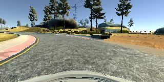

#**Behavioral Cloning**

---

**Behavioral Cloning Project**

The goals / steps of this project are the following:
* Use the simulator to collect data of good driving behavior
* Build, a convolution neural network in Keras that predicts steering angles from images
* Train and validate the model with a training and validation set
* Test that the model successfully drives around track one without leaving the road
* Summarize the results with a written report

## Rubric Points
###Here I will consider the [rubric points](https://review.udacity.com/#!/rubrics/432/view) individually and describe how I addressed each point in my implementation.  

---
###Files Submitted & Code Quality

####1. Submission includes all required files and can be used to run the simulator in autonomous mode

My project includes the following files:
* model.py containing the script to create and train the model
* drive.py for driving the car in autonomous mode
* model.h5 containing a trained convolution neural network
* writeup_report.md or writeup_report.pdf summarizing the results

####2. Submission includes functional code
Using the Udacity provided simulator and my drive.py file, the car can be driven autonomously around the track by executing
```sh
python drive.py model.h5
```

####3. Submission code is usable and readable

The model.py file contains the code for training and saving the convolution neural network. The file shows the pipeline I used for training and validating the model, and it contains comments to explain how the code works.

###Model Architecture and Training Strategy

####1. An appropriate model architecture has been employed

(model.py 53 - 67)
I used NVidia regression network, that is used in their self-driving system. I achieved the best result with least epochs using the exact approach. LeNet required twice more iterations and couldn't achieve anything close.

The network contains 10 main layers + 2 preparation layers.

- Preparation layers:
    - Lambda, normalizing each pixel.
    - Cropping frames to extract only valuable part of the frame

- Main layers:
    - 5 convolutional layers, increasing filters and setting minimum strides to retrieve more features from frame. Each layer uses ReLu as the activation functions.
    - Than 1 layer that will make our data 1 dimensional
    - and finishing NN with 4 fully connected layers. Decreasing output up to 1, to improve prediction.

####2. Attempts to reduce overfitting in the model

The model was split up on batches where each batch was shuffled before usage. That randomized validation set better.
The model was tested by running it through the simulator and ensuring that the vehicle could stay on the track.

####3. Model parameter tuning

The model used an adam optimizer, so the learning rate was not tuned manually (model.py line 69).

####4. Appropriate training data

Training data was chosen to keep the vehicle driving on the road. I used data from 2 laps driving clockwise, 1 lap counterclockwise + all image and steering wheel data were flipped to increase stability.   

###Model Architecture and Training Strategy

####1. Solution Design Approach

I tried a few approaches. The first one was LeNet implementation that could drive through half of the track without any help. I could try to gather more data but I decided to try other networks.

I tried my own solution, adding more adding 2 more convolutional layers to LeNet and a few more improvisations. There weren't any advantage over LeNet, plus it took longer to learn. Since, I'm using CPU, I moved forward to NVidia solution.
It takes relatively short time (15-25 minutes) to learn and with such small data set it shows very nice result, that you can see in the video.  


####2. Creation of the Training Set & Training Process

This is discussed above. As an addition I had trouble with curves where you can see ground. So, I added data driving slowly (about 2-3mph) in that place.

